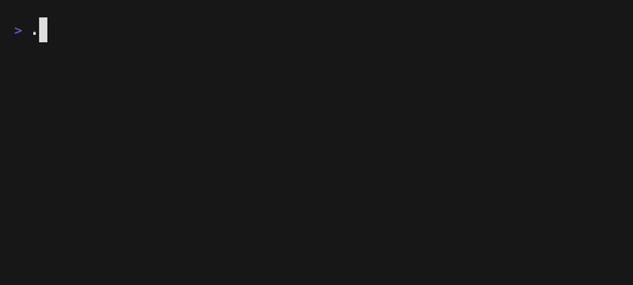

# URL Tracker Demo Generator

> How to generate a demo `.gif` file for the URL Tracker.

## Installation

> VHS requires [ttyd](https://github.com/tsl0922/ttyd) and [ffmpeg](https://ffmpeg.org/) to be installed and available on your PATH.


[Install vhs](https://github.com/charmbracelet/vhs?tab=readme-ov-file#installation):

Use a package manager:

```bash
# macOS or Linux
brew install vhs

# Arch Linux (btw)
pacman -S vhs

# Nix
nix-env -iA nixpkgs.vhs

# Windows using scoop
scoop install vhs
```

## Usage

From the `docs/demo` folder:
```bash
vhs demo.tape
```

This will generate the `docs/demo/demo.gif` file.



## Reference:

- [VHS Command Reference](https://github.com/charmbracelet/vhs?tab=readme-ov-file#vhs-command-reference)